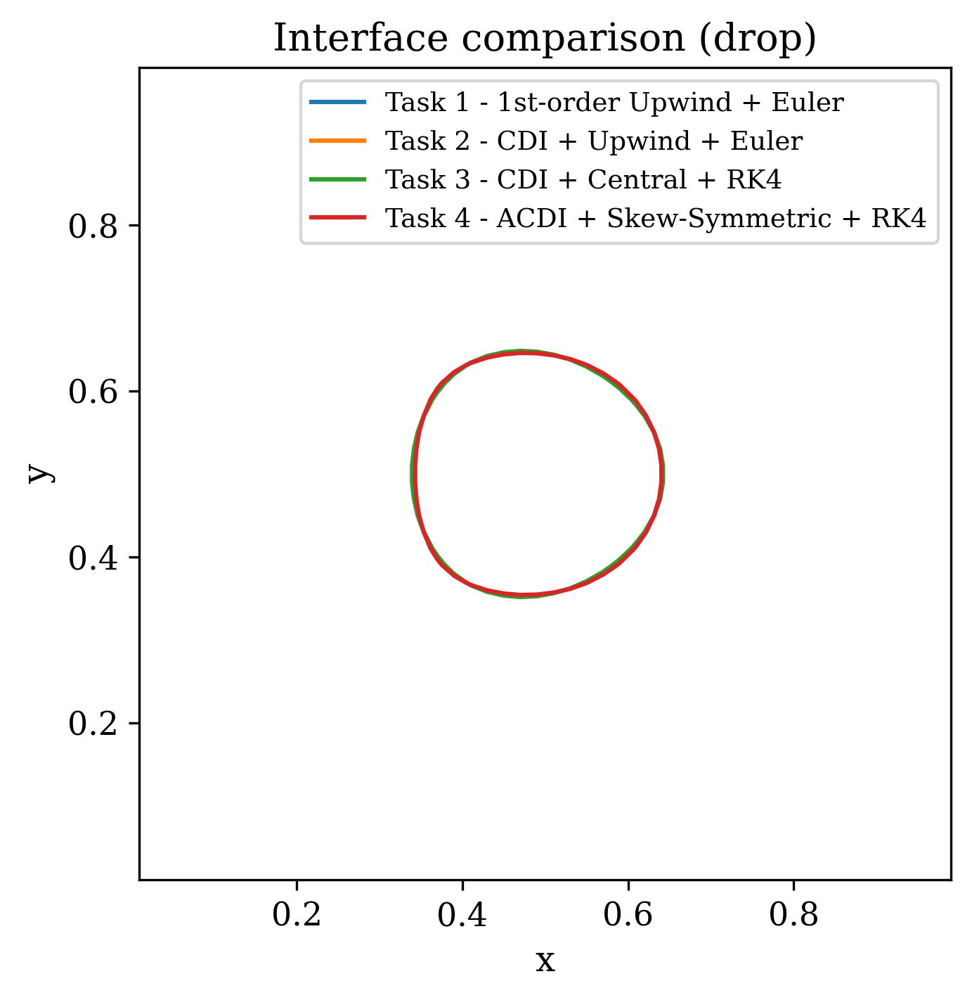
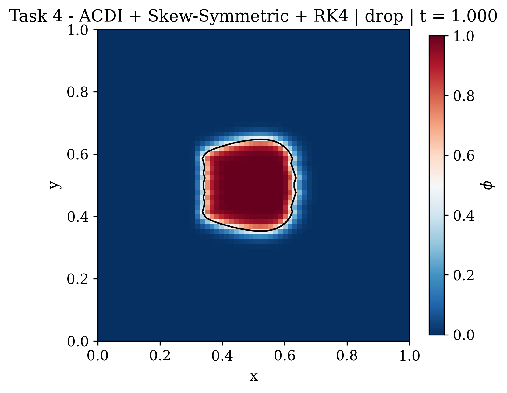

# Phase-Field Interface Methods — CDI & ACDI

Implementation of conservative diffuse-interface (CDI) and accurate CDI (ACDI)
methods for tracking fluid interfaces in 2D, based on
[Jain 2022](https://doi.org/10.1016/j.jcp.2022.111529).

Two simulations are included:

| Simulation | Entry point | Status |
|---|---|---|
| Drop advection & shear flow (Tasks 1–4) | `src/main.py` | Complete |
| 2D Droplet impact (NS + ACDI) | `src/impact_main.py` | In progress |

---

## Setup

```bash
cd src
pip install numpy matplotlib
```

---

## Drop Advection / Shear Flow

Four tasks comparing spatial/temporal schemes with and without regularisation:

| Task | Scheme |
|---|---|
| 1 | 1st-order Upwind + Euler (baseline, no regularisation) |
| 2 | CDI + Upwind + Euler |
| 3 | CDI + Central + RK4 |
| 4 | ACDI + Skew-Symmetric + RK4 |

```bash
cd src

# Run all tasks on both test cases
python main.py

# Single task, single case
python main.py --task 4 --case drop
python main.py --task 2 --case shear

# Override resolution or timestep
python main.py --task 4 --case drop --nx 128 --dt 5e-4

# Convergence study
python main.py --convergence --task 4 --case drop

# Save animations
python main.py --task 4 --animate

# Suppress plots
python main.py --no-plot
```

**Interface contour comparison (all tasks, drop advection at t=1.0):**



**Task 4 — ACDI final state:**



---

## Droplet Impact

Full 2D incompressible Navier–Stokes with ACDI phase-field interface tracking.
A liquid drop (Re=500, We=100) falls onto a liquid pool.

Physics: fractional-step projection, CSF surface tension, buoyancy body force, variable-density PCG Poisson solver.

```bash
cd src

# Quick test (no animation)
python impact_main.py --nx 64 --t-end 1.0 --no-plot

# Standard run
python impact_main.py --nx 64 --t-end 3.0 --save impact.gif

# Higher resolution
python impact_main.py --nx 128 --dt 5e-4 --t-end 2.5 --save impact_128.gif

# Change Re / We
python impact_main.py --nx 128 --re 1000 --we 50 --drop-U 2.0 --save impact_fast.gif

# Custom geometry
python impact_main.py --drop-R 0.4 --drop-cy 2.5 --pool-y 1.2 --save impact_custom.gif
```

**Impact simulation (64x64, t=0–3):**


### Known issues

The impact simulation is not fully validated and still has open issues:

- Post-impact crown topology (pinch-off, satellite drops) is resolution-sensitive; needs AMR or a 256x256+ uniform grid to match reference results
- Long-time stability beyond t=3 at 128x128 is not verified
- CDI (Task 2) drop advection has an overflow bug when phi exits [0,1]

Contributions are welcome. The NS solver is in `src/impact/ns_solver.py` and the
time loop in `src/impact/solver.py`.

---

## Project structure

```
src/
├── main.py               # Tasks 1–4 entry point
├── impact_main.py        # Droplet impact entry point
├── config.py             # Global configuration
├── core/
│   ├── mesh.py           # Uniform 2D mesh
│   ├── regularization.py # CDI & ACDI kernels (Jain 2022)
│   ├── flux_schemes.py   # Upwind, central, skew-symmetric advection
│   └── time_integration.py
├── solvers/              # Per-task solvers (task1–task4)
├── impact/               # NS solver, initial conditions, plotting
├── test_cases/           # Drop advection & shear flow runners
└── postprocessing/       # Error analysis, plotting, animation
```

---

## Reference

> Jain, S. S. (2022). *Conservative diffuse interface method for compressible
> multiphase flows*. Journal of Computational Physics, 469, 111529.
> https://doi.org/10.1016/j.jcp.2022.111529
